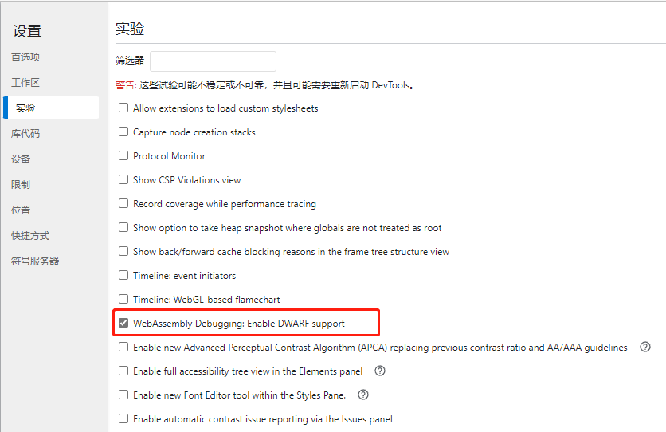
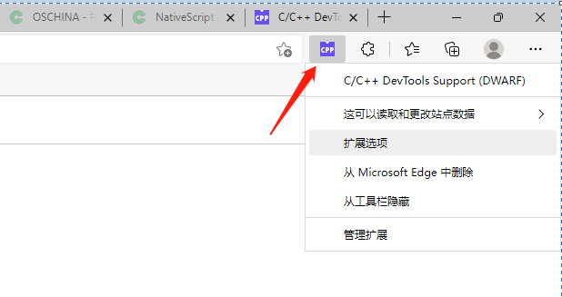
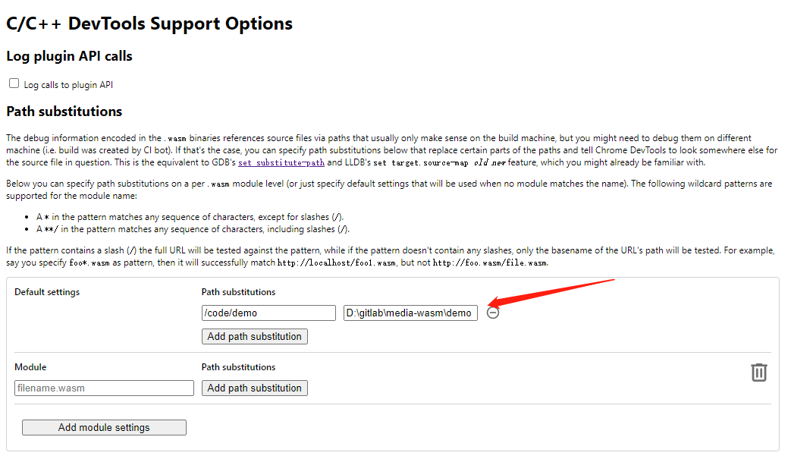
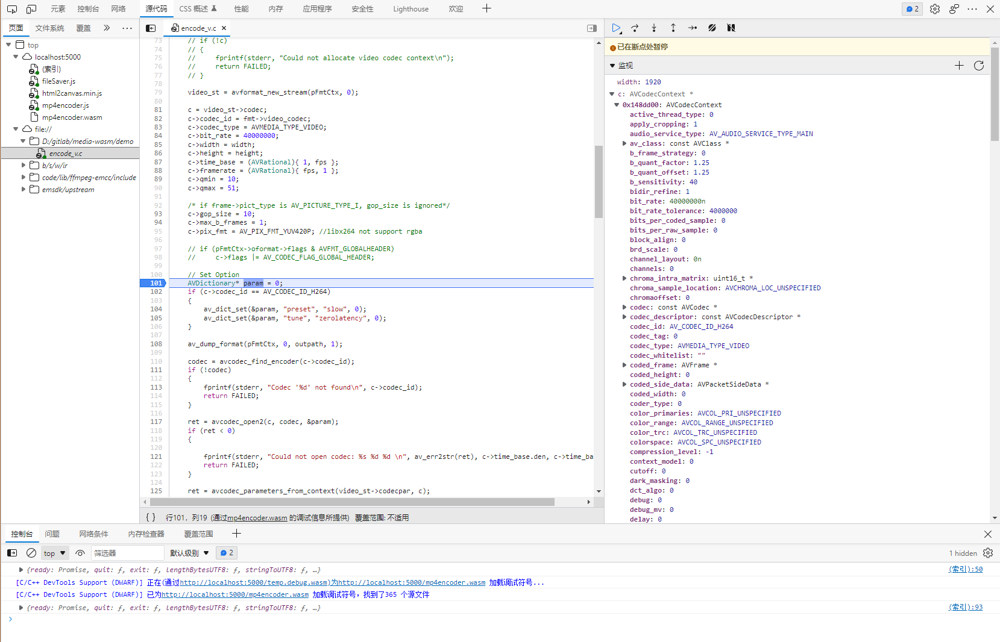

# WebAssembly 开发环境搭建
## 简介
WebAssembly 是一种新的编码方式，可以在现代的网络浏览器中运行 － 它是一种低级的类汇编语言，具有紧凑的二进制格式，可以接近原生的性能运行，并为诸如 C / C ++等语言提供一个编译目标，以便它们可以在 Web 上运行。它也被设计为可以与 JavaScript 共存，允许两者一起工作。

简而言之，对于网络平台而言，WebAssembly 具有巨大的意义——它提供了一条途径，以使得以各种语言编写的代码都可以以接近原生的速度在 Web 中运行。在这种情况下，以前无法以此方式运行的客户端软件都将可以运行在 Web 中。

WebAssembly 被设计为可以和 JavaScript 一起协同工作——通过使用 WebAssembly 的 JavaScript API，你可以把 WebAssembly 模块加载到一个 JavaScript 应用中并且在两者之间共享功能。这允许你在同一个应用中利用 WebAssembly 的性能和威力以及 JavaScript 的表达力和灵活性，即使你可能并不知道如何编写 WebAssembly 代码。

本文展示了一个将FFmpeg应用到WebAssembly中的例子。

# 编译环境
https://hub.docker.com/r/emscripten/emsdk/tags  
拉取远程镜像
```bash
docker pull emscripten/emsdk:2.0.24
```

# 启动容器
映射自己的目录
```bash
docker run -d -it --name mediawasm -v d:/.../wasmff:/code  emscripten/emsdk:2.0.24 /bin/bash
```

# 编译
编译脚本
```bash
#!/bin/bash

#set -eo pipefail

WORKPATH=$(cd $(dirname $0); pwd)

DEMO_PATH=$WORKPATH/demo

echo "WORKPATH"=$WORKPATH

rm -rf ${WORKPATH}/demo/mp4encoder.js ${WORKPATH}/demo/mp4encoder.wasm

FFMPEG_ST=yes

EMSDK=/emsdk

THIRD_DIR=${WORKPATH}/lib/third/build

# 生成调试文件
DEBUG="-g -fno-inline -gseparate-dwarf=/code/demo/temp.debug.wasm -s SEPARATE_DWARF_URL=http://localhost:5000/temp.debug.wasm"

#--closure 压缩胶水代码，有可能会造成变量重复定义。生产发布可设为1
OPTIM_FLAGS="-O1 $DEBUG --closure 0"

if [[ "$FFMPEG_ST" != "yes" ]]; then
  EXTRA_FLAGS=(
    -pthread
    -s USE_PTHREADS=1                             # enable pthreads support
    -s PROXY_TO_PTHREAD=1                         # detach main() from browser/UI main thread
    -o ${DEMO_PATH}/mp4encoder.js
  )
else
  EXTRA_FLAGS=(
    -o ${DEMO_PATH}/mp4encoder.js
  )
fi

FLAGS=(
  -I$WORKPATH/lib/ffmpeg-emcc/include -L$WORKPATH/lib/ffmpeg-emcc/lib -I$THIRD_DIR/include -L$THIRD_DIR/lib
  -Wno-deprecated-declarations -Wno-pointer-sign -Wno-implicit-int-float-conversion -Wno-switch -Wno-parentheses -Qunused-arguments
  -lavdevice -lavfilter -lavformat -lavcodec -lswresample -lswscale -lavutil -lpostproc 
  -lm -lharfbuzz -lfribidi -lass -lx264 -lx265 -lvpx -lwavpack -lmp3lame -lfdk-aac -lvorbis -lvorbisenc -lvorbisfile -logg -ltheora -ltheoraenc -ltheoradec -lz -lfreetype -lopus -lwebp
  $DEMO_PATH/encode_v.c
  
  -s FORCE_FILESYSTEM=1
  -s WASM=1
  -s USE_SDL=2                                  # use SDL2
  -s INVOKE_RUN=0                               # not to run the main() in the beginning
  -s EXIT_RUNTIME=1                             # exit runtime after execution
  -s MODULARIZE=1                               # 延迟加载 use modularized version to be more flexible
  -s EXPORT_NAME="createMP4Encoder"             # assign export name for browser
  -s EXPORTED_FUNCTIONS="[_main,_malloc,_free]" # export main and proxy_main funcs
  -s EXPORTED_RUNTIME_METHODS="[FS, cwrap, ccall, setValue, writeAsciiToMemory]"   # export preamble funcs
  -s INITIAL_MEMORY=134217728                   # 64 KB * 1024 * 16 * 2047 = 2146435072 bytes ~= 2 GB
  -s ALLOW_MEMORY_GROWTH=1                      # 允许动态扩展内存
  --pre-js $WORKPATH/pre.js
  --post-js $WORKPATH/post.js
  $OPTIM_FLAGS
  ${EXTRA_FLAGS[@]}
)
echo "FFMPEG_EM_FLAGS=${FLAGS[@]}"

emcc "${FLAGS[@]}"

```
```bash
./build-demo.sh
``` 
会在项目目录下生成 ```mp4encoder.js``` 与 ```mp4encoder.wasm``` 其中js文件文件为胶水代码，使得C++接口能在浏览器js中调用。实际的C++逻辑存放于wasm文件中。

在容器外的项目目录下, 启动web静态服务器查看效果

# 调试
介绍  
https://developer.chrome.com/blog/wasm-debugging-2020/  
下载安装插件  
https://goo.gle/wasm-debugging-extension  
 
1、打开开发者工具，设置(F1) -> 实验 -> 勾选 WebAssembly Debug
 
2、因为项目在Docker下编译，需要把Docker路径映射到本地磁盘
 

3、打开开发者工具 -> 源代码 -> 左侧file://下即可找到源代码 -> 设置断点 -> 右侧监视添加变量 



# 参数传递
## 简单参数传递
```js
  //把js string 转成 utf8 array
  var getCStringPtr = function (jstr) {
    var lengthBytes = lengthBytesUTF8(jstr) + 1;
    var p = MP4Encoder._malloc(lengthBytes);
    stringToUTF8(jstr, p, lengthBytes);
    return p;
  }
  //allocateUTF8功能相同

  //值类型可以直接传递，string必须先转array
  var strPtr = getCStringPtr("/tmp/demo2.mp4");
  var ret = MP4Encoder._createH264(strPtr, 1920, 1080, 25);
```
## 大块内存拷贝
```js
    //js 数组内存
    let fileBuffer = new Uint8Array(imagedata.data.buffer);
    //wasm 数组内存
    let bufferPtr = MP4Encoder._malloc(fileBuffer.length);
    //js -> wasm
    MP4Encoder.HEAP8.set(fileBuffer, bufferPtr);
    var ret = MP4Encoder._addFrame(bufferPtr);
```

```_malloc``` 和 ```_free``` 这些系统方法是模块默认导出的。如果想查看其他方法是否可用，可以控制台打印MP4Encoder模块看其挂载的方法

# 文件读写
```html
<input type="file" value="选择文件" onchange="inputJsFile(event)"></input>
```
```js
  var inputJsFile = function (event) {
    let file = event.target.files[0];

    file.arrayBuffer().then(t=>{
      console.log(t)
      //创建文件夹
      FS.mkdir('/working');
      //写入二进制数据到wasm虚拟目录
      FS.writeFile('/working/input.txt', new Uint8Array(t), { flags:'w+' });
      //查看写入成功
      console.log(FS.stat('/working/input.txt'))
      //从wasm读取到js
      var buff = FS.readFile('/working/input.txt', { encoding: 'binary' });
      console.log(buff)
      var pStr = getCStringPtr("/working/input.txt");
      var ret = MP4Encoder._openTestFile(pStr);
    });
  }
```

扩展阅读
https://developer.mozilla.org/zh-CN/docs/WebAssembly
https://developer.mozilla.org/zh-CN/docs/Web/API/IndexedDB_API
https://emscripten.org/docs/api_reference/index.html
